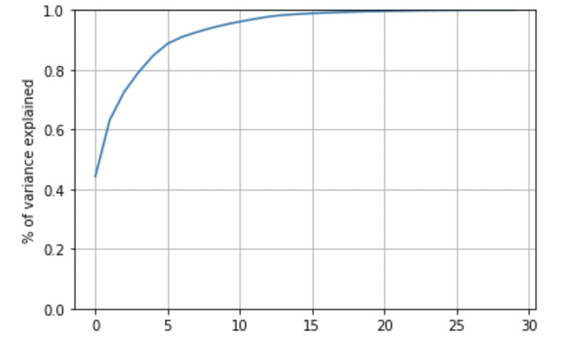
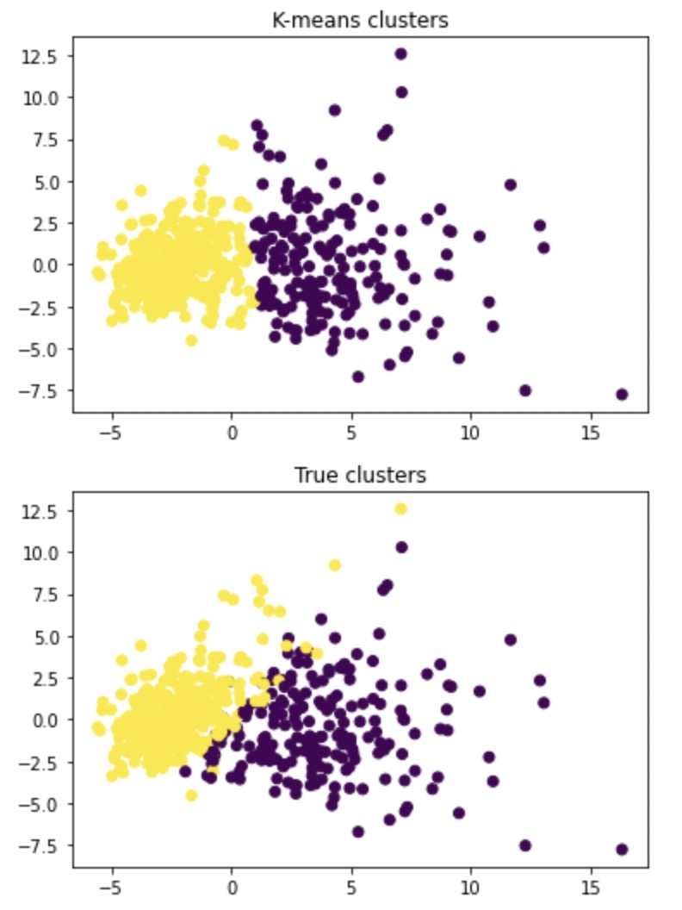
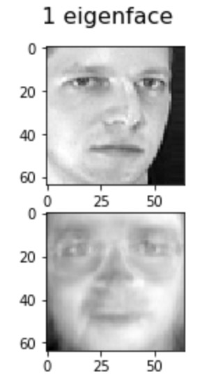
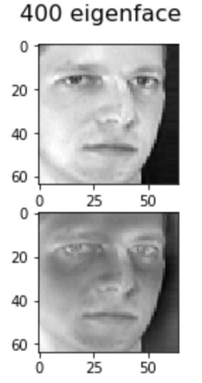
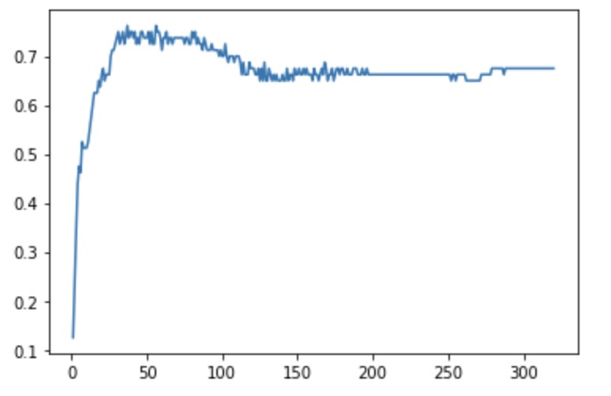

# PCA and K-means cluster

## Content

1.  Breast cancer cluster
2.  Fetch_olivetti_faces image compression

## Breast cancer cluster

I use the load_breast_cancer from sklearn dataset, and use PCA to compress the features to 2 dimensions. There are 0.632 components explained in 2 dimensions. 

Then I use kmeans to aggregate the data into two categories, namely, cancer and no cancer. Finally, compare with the real data and calculate the misdiagnosis rate. The misdiagnosis rate is 0.0949.

## Fetch_olivetti_faces image compression

I use the fetch_olivetti_faces from sklearn dataset, and use PCA to compress the features to different dimensions. I show the compressed images under different dimensions and compute the explained variance ratios of these images. The explained variance ratio when use 1 eigenface is  0.238, and the explained variance ratio when use 400 eigenfaces is  0.99999995

I set the reduced-dimensional face image as an independent variable, and set the corresponding character number of the face image as the dependent variable, divide the data into a training set and a test set, and use the knn algorithm for classification learning. Then the training set image is brought into the model to identificate the person's number corresponding to the image, and the accuracy of the model recognition in different dimensions is calculated. The results show that the accuracy is the highest when the image is reduced to 81 dimensions, 96 dimensions and higher dimensions, with an accuracy of 0.925.